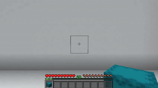
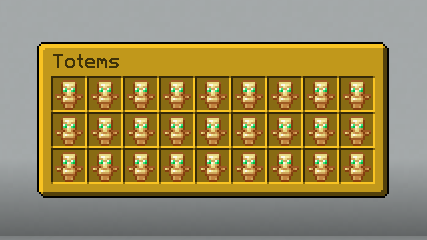
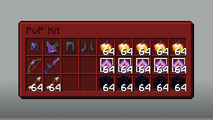
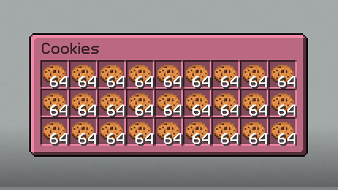
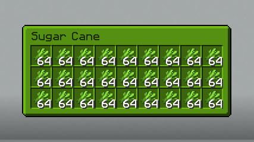

# Shulker Preview

---

Shulker Preview is a client-side mod that lets you open a shulker without placing it (however, you can't take the items it contains).  
The button to view the contents of the shulker can be changed from the game options.

Here is a demo :

As of **version 1.1**, you can also open shulkers in inventory and containers by right-clicking.

**Each shulker color has its own display :**

|  |    |
|-------------------------------------------|---------------------------------------|
|      |  |
